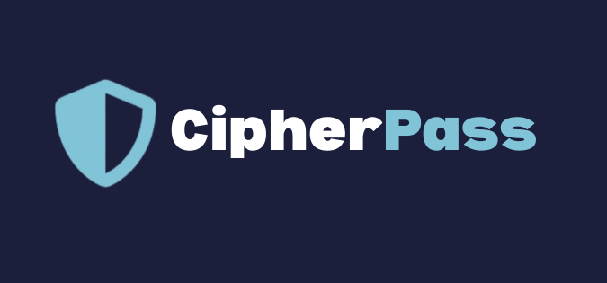

# CipherPass

  

## Live Link  
[https://cipherpass.onrender.com/](https://cipher-pass-frontend.vercel.app/)  

## Overview  
CipherPass is a **secure password management application** that encrypts and stores user credentials, ensuring they remain protected and accessible only to authorized user.  

It uses **RSA encryption**, where each client generates a **unique public-private key pair** to encrypt and decrypt passwords locally. The client can also **regenerate keys** at any time for enhanced security. Additionally, the server manages its own **encryption keys**, adding an extra layer of protection when storing passwords in the database.  

With **end-to-end encryption (E2EE)**, CipherPass is a highly secure and privacy-focused solution. 🚀  

## 🛠️ Tech Stack  
- **MongoDB** - NoSQL database for storing user data.
- **Express.js** - Web application framework for Node.js.
- **React.js** - Frontend framework for building the user interface.
- **Node.js** - Backend runtime environment.
- **RSA Module** - Used for password encryption and decryption.
- **JWT** - Token-based authentication for user sessions.
- **NodeMailer** - Used for the forgot password functionality, sending emails.
- **Tailwind** - Designing Frontend UI.

## ✨ Features  

- **User Authentication** – Secure **login & registration** with **JWT**  
- **Secure Password Storage** – Uses **RSA encryption** for storing and retrieving passwords securely  
- **End-to-End Encryption (E2EE)** – Passwords are **encrypted before leaving the client** and decrypted only when accessed securely  
- **Client-Side Key Management** – Users generate **strong RSA key pairs** (public & private) on their device, ensuring **zero-knowledge encryption**  
- **Server-Side Encryption Layer** – Server **encrypts and decrypts data** using its own **secure key pair**, adding an additional **security layer**  
- **Regenerate Keys Option** – Users can **regenerate RSA keys** anytime, improving security and control  
- **Update & Delete Passwords** – Manage stored passwords securely  
- **Forgot Password Recovery** – Reset passwords via **email** using **NodeMailer**  
- **Fully Responsive UI** – Works on **all screen sizes**  

This ensures **maximum security** by keeping **private keys client-side** while allowing the server to manage encrypted data effectively. 🚀

## 🤝 Contributions  
Contributions are welcome! If you have ideas for **new features, bug fixes, or improvements**, feel free to submit a pull request.  

### How to Contribute  
1. **Fork the repository**  
2. **Create a new branch** (`git checkout -b feature/YourFeatureName`)  
3. **Commit your changes** (`git commit -m "Add Your Feature"`)  
4. **Push to the branch** (`git push origin feature/YourFeatureName`)  
5. **Open a pull request**  

---

## 👨‍💻 Authors  

**Pranav Jarande**  
📧 jarandepranav2004@gmail.com  
🔗 [GitHub](https://github.com/pranavjarande)  

**Riya Shewale**  
📧 riyashewale@gmail.com  
🔗 [GitHub](https://github.com/RiyaShewale) 
